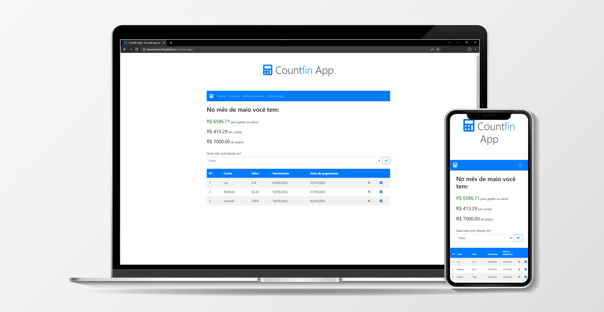

# Countfin App - Simples para controle financeiro

Controle e visualize suas contas do mês que quiser de forma fácil e sem cadastrar conta!

Veja a [demo](https://laurencezanotti.github.io/countfin-app/) no GitHub Pages!

## Como usar

1. Acesse a [demo](https://laurencezanotti.github.io/countfin-app/) ou clone o projeto para rodar na sua máquina se preferir.
2. Clique no menu em **Adicionar contas**
3. Preencha o form para quantas contas quiser
4. Veja as contas aparecendo na lista abaixo!

Você também pode: 

- Ver as contas na página **Home** e os seus gastos mensais
- Buscar uma conta específica na página **Procurar**

## Motivação

Este app é feito com JavaScript puro (sem frameworks) para fins de estudo. Créditos também para [@bradtraversy](https://github.com/bradtraversy) e o canal dele no youtube, [Traversy Media](https://www.youtube.com/channel/UC29ju8bIPH5as8OGnQzwJyA), que me ajudou com a funcionalidade essencial, como adicionar e deletar items de uma lista no DOM.

Alguns recursos que aprendi a criar:

- CRUD básico (Create, Read, Update, Delete)
- Base de dados com localStorage API
- Barra de busca dinâmica
- Edição dinâmica com contentEditable do HTML5
- Feedback com alertas e estilos da interface (UI/UX)
- Formatação de datas com day.js

Este projeto tem me ajudado a aprender muitos conceitos fundamentais e intermediários de programação com JavaScript, e com o passar dos anos, minha visão para esse projeto tem se expandido. Cada feedback seu é extremamente valioso.

## Contato

- [LinkedIn](https://www.linkedin.com/in/laurence-zanotti/)
- Email 📩 - laurencezanotti@gmail.com
